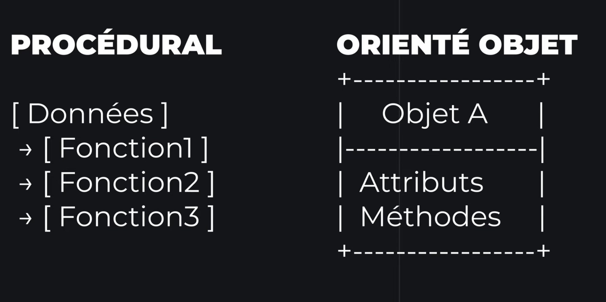
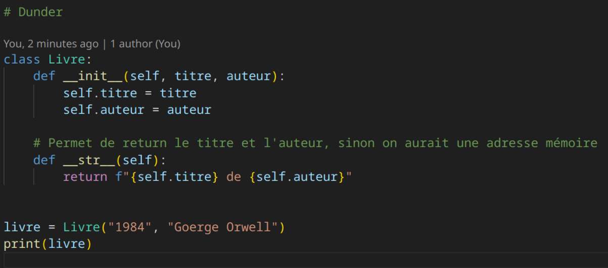
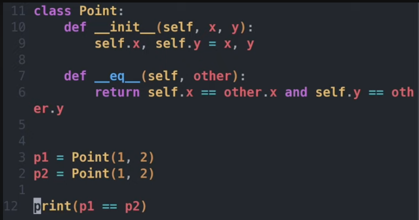
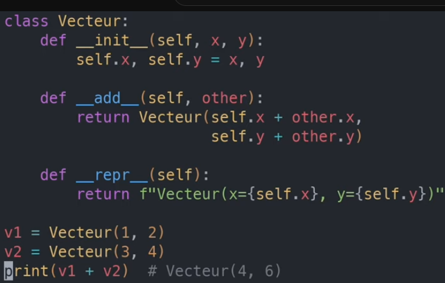

La poo VS procédural 

méthode (POO) = fonction (procédural)

## self
self est obligatoire, il fait en gros référence à l'instance actuelle, chaque objet à sont propre self et c'est juste une convention (on pourrais l'apeller autrement)

## Vocabulaire

objet = Instance d'une classe 

Classe = 

Méthode = 

Encapsulation = permet de protéger les données, empêche les erreurs, contrôler les modifications de données

# Encapsulation

il y a des données publiques, privées ou encore protéger. En python c'est pas forcément ce qu'il y a de plus sécuriser (il suffit juste de rajouter __NomClass et on y accède, cependant c'est une bonne pratique pour les autres languages comme Java),

# Getter et setter

on peut utiliser des getter et des setters pour simplifier les accès

# @property en python
@property permet de définir les propriétés d'une fonction dans une classe. (pas besoins dans mon cas)

# Héritage

L'héritage permet de facilement récupéré les informations de la classe parent, il est posible de faire de l'héritage multiple

# Polymorphisme

Permet d'utiliser la même classe en héritage dans plusieurs autres class avec des éléments différents
--> On créer une class animal avec une fonction qui permet de parler. On créer ensuite deux classe (Une chien et une chat, qui hérite toutes les deux de animal).
Ensuite on créer par exemple une fonction "parler" dans les deux (chat et chien) et qui print un truc différent.

# Abstraction
On créer une classe abstraite qui nous sert d'interface / de plan, on ne vas pas s'en servir directement mais elle vas forcer l'implémentation de certaines méthodes dans les classes qui hérite du parent.

# Composition

On peut faire appelle à d'autres classe depuis une autre classe. Par exemple --> Dans la classe ordinateur, on pourrais apeller de la manière suivante la classe clavier : 
self.clavier = Clavier()

Cela nous permetterais de pouvoirs

# Dunder

Méthode sécial commencant par __ et terminant par __
Permet de changer le comportement de la classe (Print différement par exemple)

il existe aussi des dunder qui permettent d evérifier des égaliter, les dunder __eq__

# Dataclass

